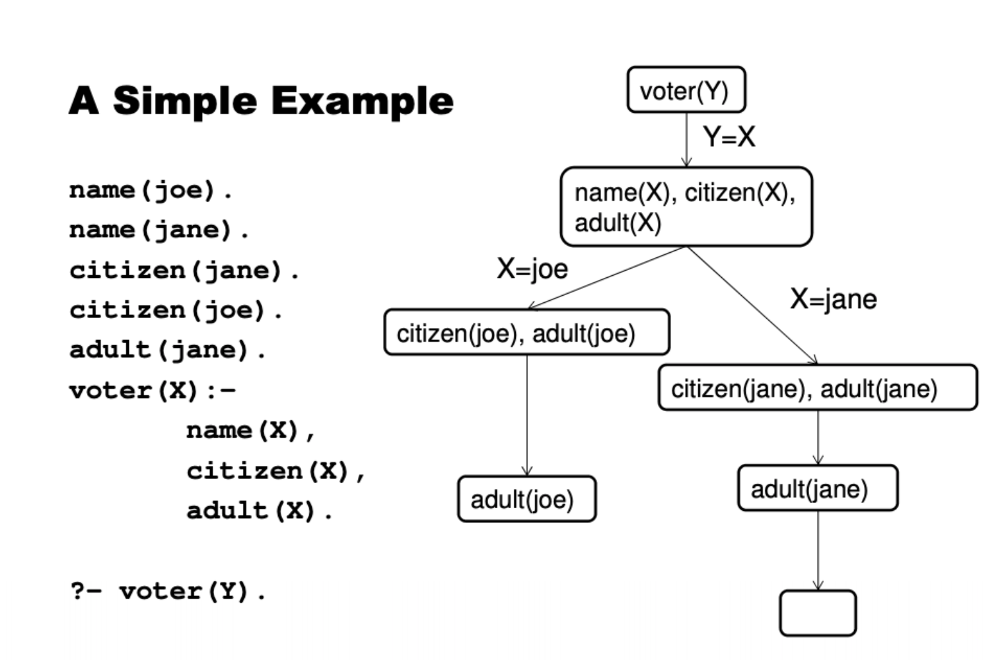
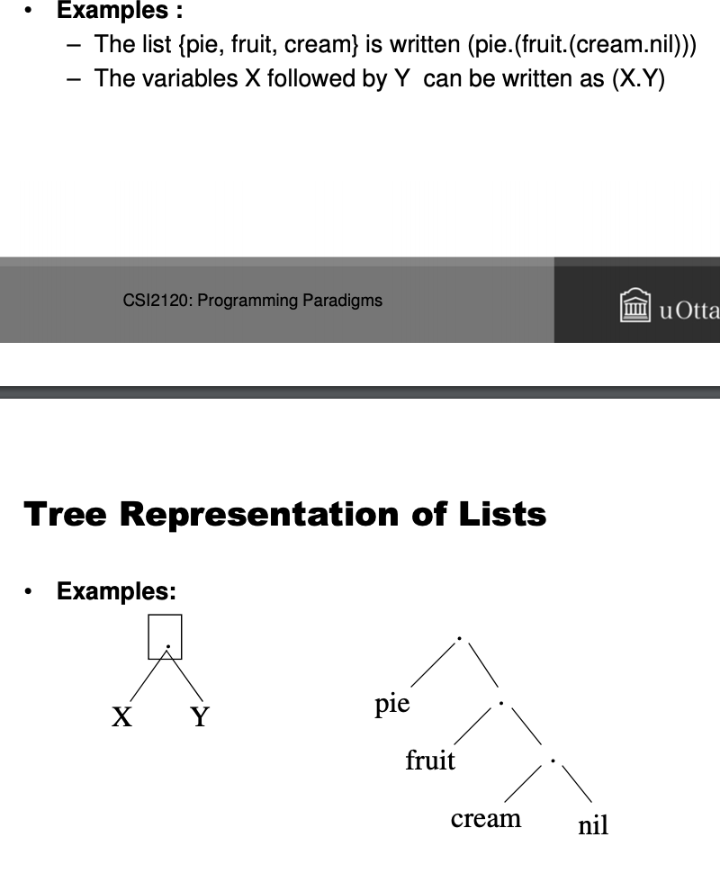

# PROLOG NOTES!

#### Declarative and logic programing. 
* AI, RDMS, Natural Language, Mathematics, Abstract, Design, symbolic equation solving

* Descriptive : knows facts and relationships about a problem as oppose to taking steps to solving a problem. 
  
#### Programing in Pl 

* Specify Facts! (always true,  Qasim likes JS Fact -> [Likes (qasim, js). ] )
* Relationship -> likes  (all lower case and relationship(predicate) is written first followed by arguments in parenthesis and ending in " . " )
* In predicate the order is impotent liker(qasim) first then liked(JS) in like fact. 
```prolog
domestic(cows). % cows are domestic animals.
faster(horses,cows). % horses run faster than cows
take(cats,milk,cows). % cats take milk from cows
isYellow(hay). % hay is yellow.
eat(cows,hay). % Cows eat hay.
```
* Facts are stored in database.
```prolog 
Database 
like(horses,fish).
like(dogs,cats).
like(cats,mice).
like(dogs,mice).
like(horses,racing).
like(cats,horses).
like(tigers,cats).
like(cats,hay).
like(cows,grass).
like(cows,hay).
like(horses,hay).

Simple Queries 

?- like(dogs,bones).
?- like(cats,dogs).
?- like(cats,hay).
?- enjoy(horses,racing).
%Pl answers yes or no! 
``` 
* Define rules:- A general statement about object and their relationships. 
```Prolog
%we define a relationship that if anyone likes 'hay' horses like it too

likes2(horses,X) :- like(X,hay).
%horses likes 'X' if X likes hay! 
% " :- ' -> we read that as ' if ' 
%Head of the left of ':-' body on the right of ':-" 

%Body could be a conjunction or disjunctive.
% – “Horses like X if X like hay and mice."
like(horses,X) :- like(X,hay), like(X,mice).
```
* Run Queries 

#### Computing in PL 

* logical semantics 
* What future facts can be driven ?
* By what information has been supplied by the user. some form of imperative (giving an authoritative command; peremptory. )perspective 

#### Variables 
* use variable to ask prolog what it could be in database?  
```
like (cat, x)
%x = mice 
```
* Pl looks thru the DB for facts that unifies with the question
* pl then looks for predicate 'like' and first argument 'cat'
* upon finding 'X' gets instantiated with the second argument of the fact. 
* facts is searched from top to bottom . 
* 'X' is instantiated to 'mice' 
* we use ' ; ' to tell pl to look for another solution. (OR)
```prolog
%OR ;
like(cat, mice); like(cat, dog).
?- true [True or Flase = True]

%AND ,
like(cat, mice), like(cat, dog).
?- False [True and Flase = False]
```
* Variable to find the common one among facts 
```prolog
%Anything both horse and cat like ?

like(cows,X), 
like(horses,X).
X = hay
```
## Pl Proofs 

#### Predicate Calculus! 

* Rule has a body! facts end without a body. 
* Anonymous variable ' _ '
```prolog
%Anon Variable 
likes (X ):- like(_, hay)
true. %there exist likes with anaon value that like hay
```
* equality :  
> ≡ 
* negation
> ¬
* logic binary connections: 
> ∨,∧, → 
* Quantifiers 
>  ∀ For all, ∃ There exists. 

#### Predicate in PL

```prolog
% And -> for all a are true implies b is true 
%this is a fact cux truth is implied.
b <- a1 ^ a2 ^ a3
```
#### Horn* Clauses. 

* foundation of logic programing. 
* Conjunctive normal form is conjunction og Horn Clause.

* Implication (a implies b) 
> not(a) or b
* Equivalence a ≡ b is same as
> ((a) and (b)) or (not (a) and not (b))

* Horn Formula 
  {
      (not( (A and B) or f ) )  ≡  (not A or not B or F)
   }

#### Search Trees.

* Search trees are queries.
* question is root nodes/vertices are decisions and show which goals 
* leaf with goal one or more are failure nodes 
* empty leaf are success nodes. 
* path from root to leaf contains unification's and steps needed for proof. 
 


#### Solution Strategies of prolog 
root = head. 
empty leaf  = true! 
filled leaf = flase.

## Arithmetic Expression and I/O

  * supports common arithmetic 
  * built ins include 
  * repeat goes one till end. loops forever
  * cur ! -> stops backtracking, 
```prolog
  x//y %integer division 
  x mod y %mod
  abs(X)
  ln(X)
  sqrt(X)
  ```

  * unification  of 1+2 and 3 fails as 3 is a number while 1+2 is a term. we use 
  ```
  % is 

  3 is 1+2
  true. 
  ``` 
  * Comparison 
```prolog
X = :  = Y % X Equals Y
X = \ = Y % X not Equals Y
X < Y
X =< Y
X>Y
X>=Y
so 
1+2 = : = 2+1
true. 

%Min predicate 
min (X, Y, X) : - X<Y.
min (X, Y, X) : - X>=Y.
```
* postive powers 
```prolog
%recursion to calculate power to 1
pow( X, Y, Z ) :- Y > 1,
    Y1 is Y - 1,
    pow( X, Y1, Z1 ),
    Z is X * Z1.
```

#### Input and Output. 
```prolog
%OUTPUT
– write(X). adds the value of X to the currently active
output stream (by default the console).
– Example:
• write(1+2) outputs 1+2
– nl is the new line command, i.e.,
• writeln(X) :- write(X), nl.
– tab(N) outputs N spaces

%INPUT
read(X). 
:aaa
X= aaa

#### Repeat Predicate (built-in)
• The built-in predicate repeat is a way to generate multiple
solution through backtracking.
• Definition
repeat.
repeat :- repeat.
• Example
test :- repeat,
write('Answer to everything? (num)'),
read(X),
(X=:=42).
```

#### Example: Write to File
```prolog
Write X to file
writeFile(X):- open('test.txt', append, F),
write(F, X), nl(F),
close(F). 
```

#### Example: Province PL
```prolog
capital(ontario,toronto).
capital(quebec,quebec).
start :- write('The capitals of Canada'),nl,
askP.
askP :- write('Province? '), read(Province),
answer(Province).
answer(stop) :- write('Exiting'),nl.
answer(Province) :- capital(Province,City),
write(City),write(' is the capital of '),
write(Province),nl,nl,
askP.
```
#### Cut 

* When a fact is proven and we do not need to go further, that is when we use cut. 
```prolog
%Human is either male or female so we dont need to further, it will cut of some back tracking path 

human(U) :- male(U), !. 
human(U) :- female(U), !. 
```

* Analyse the code 
```prolog
max(X, Y, X) :- X >=Y. 
max(_,Y,Y). 
```
* gives max of two number but upon hitting " ; " the second max always gives out y
* solution? use *CUT* as an if else 
```prolog
% using cut
max(X,Y,X) :- X>=Y, !.
max(_,Y,Y). 
```
#### Fail predicate always fails!!!
is_false(P) :- P, !. fail. 
is_false(P). 

## LIST!!!
* List in pl of form [] empty list, [1,2,3,4] list with 4 elements. 
* list [H|T] of [1,2,3,4] is H=1, T=[2,3,4] T is always a list. 
* simple list predicate
```
mylist([1], [yes,no], L).
L= [1, yes, no]
```
#List processing
#### List members 
* listmembers(X,[X|L]). % is head the boundary case 
* listmembers(X, [Y|L]) :- listmember(X,L)
#### List lengths
lLength([],0). 
lLength([X|L],N):- lLength(L,NN),
                    N is NN+1. 
#### List lengths
lLength([],0). 
lLength([X|L],N):- lLength(L,NN),
                    N is NN+1. 

#### List insertion
lInsert(A, L, [A|L]). 
linsert(A, [X|L], [X|LL]) :- listInsert (A, L, LL). 

#### Joining list 
appendL([], Y, y).
appendL([A|B], Y, [A|W]) :- appendList(B, Y, W).

#### List of characters. 
read_line(line) :- get_char(C), read_line(C, Line). 
read_line('\n', []) :- !. 
read_line(C, [C|Rest]):- c\= '\n', get_har(NextC), readline(NextC, Rest).

#### List representation
* can be written with symbols. 
* The list {aa,bb,cc,dd}  can be written as (aa.(bb.(cc.(dd.nil))))
* 
* The notation X.Y represents X as head and Y as tai.
* x.y is not a list but a pair for list it should have bracket x.(y.nil)

#### List insertion and deletions
* lInsert(A, L, [A|L]).
* lInsert(A, [X|L], [X|LL]):- linsert(A,L,LL).

* Deletion of first occurrence of an element. 
  * dFront(R, [R|L], L). %element Found. 
  * dFront(R, [X|LL], [X|L]):- dFront(R, LL, L).  
* Delete all occurrence of an element. 
  * dAll(_, [], []). % if empty return empty. 
  * dAll(X, [X|T], Result) :- dAll(X, T, Result), !. %delete once. 
  * dAll(X, [H|T], [H|Result]) :- dAll(X, T, Result), !. %delete once. 

```prolog
%Put X as the first element to L
 XL = [X|L]. 
%Put X as the k-th element to L
putk(X,1,L,[X|L]):- !.
putk(X,K,[F|L],[F|LX]):- K1 is K-1, putk(X,K1,L,LX).
%Delete one X from L (indeterministic!)
 del(X,[X|L],L).
 del(X,[Y|L],[Y|L1]):-
 del(X,L,L1).
%Delete all X from L
 delall(_,[],[]):- !.
 delall(X,[H|L],[H|LL]):- X \= H,!, delall(X,L,LL).
 delall(X,[X|L],LL):- delall(X,L,LL).
```

#### List intersection. 
* If the lis empty return empty list
  * InterSect([], _, []).

* check if member of the list, return intersection from there. 
  * interSect([X|Xx], Ys, Zs) :- not(member(X, Ys)), 
     interSect(Xs, Ys, Zs). 

#### Quick Sorting in list 
```prolog
  sortList([], []).  %basecase
sortList([P|Q], T) :- partitionList(P,Q,G,D),
                      sortList(G, GG), 
                      sortList(D, DD), 
                      appenf(GG, [P|DD], T).
```
* Splitting list with pivot. 
  * one greater than pivot.
  * one smaller than pivot. 
  ```prolog
    partitionList(P,[X|L],[X|PG],PD):- X@<P, % or lessThan(X, P)
    partitionList(P, L, PG, PD).
    partitionList(P,[X|L],[X|PG],PD):- X@>=P 
    partitionList(P, L, PG, PD).
    partitionList(P, [], [], []).
  ```

#### Invert the list. 
* mirroe ([], []).
* mirror ([X|L1], L2):- mirror[L1, L3], 
  append(L3, [X], L2). 
OR

reverList([], L, L) :-!.
reverList([H|T], L, R) :- reverList(T, [H|L], R). 

mirrroAcc(L,R) :- (L, [1,2,3]). 
L= [3,2,1]. 